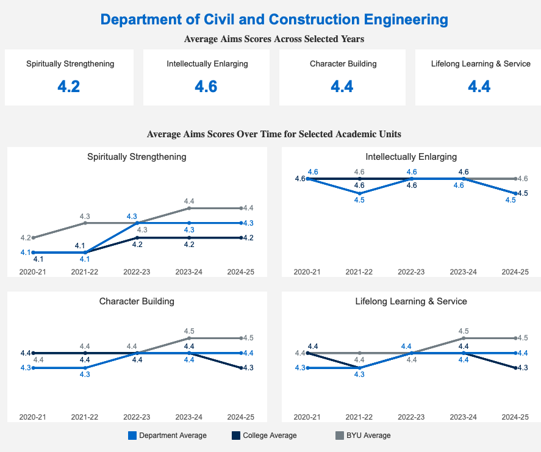

# Student Course Evaluations {#sec-eval}

In completing the evaluation of each course, students indicate how well they felt 
the course advanced the Aims of a BYU Education, which are that a BYU Education should be

  - Spiritually strenghening
  - Intellectually enlarging
  - Character building
  - Leading to lifelong learning and service

Students rate each course on a five-point scale. @fig-eval shows the Department averages for each course
over the last few years. These evaluations have remained largely stable across all categories, but these numbers
unfortunately cannot be disaggregated by program. 

{#fig-eval}

::: {.callout-note title="Assessment Practices" collapse="true"}
The program coordinator has access to a dashboard at [data.byu.edu](https://data.byu.edu) that presents the 
aggregated course evaluation data.

Each May, the assessment coordinator retrieves the most recent course evaluation
data from the portal and updates the image in the `data/student_ratings.png` file and renders the page.
:::

The department also uses student evaluation data to identify strengths and
weaknesses in faculty development. This information is not used in program assessment.
