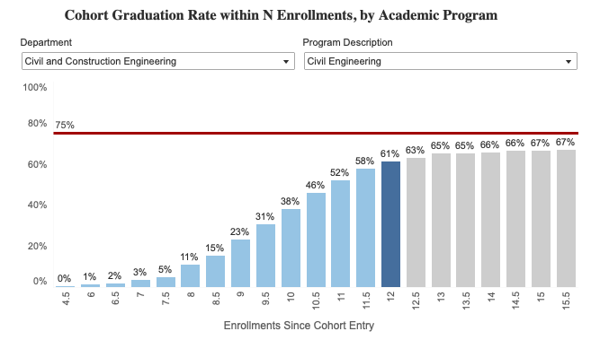

# Student Progress {#sec-progress}
```{r setup, include=FALSE}
library(tidyverse)
library(readxl)

knitr::opts_chunk$set(echo = FALSE)
ggplot2::theme_set(ggplot2::theme_bw())
```

The CE program is interested in ensuring that students are progressing in the major. We do this
by advocading for students to meet regularly with the department academic advisor; monitoring
courses with high rates of D, E, or W grades; and tracking student time to graduation.

## Student Advisement {#sec-advisement}

Student advisement is an important part of student progress in the major. The
department academic advisor helps students understand program requirements,
sequence prerequisites, plan for graduation, and resolve registration barriers.
The advisor also providesearly guidance to prospective students, new admits,
transfer students, and students returning from leave or mission deferment.

The university requires students to meet with the department academic advisor to clear
for graduation. The university also requires students to meet with the department
academic advisor to register for courses after being placed on academic probation 
to develop an academic improvement plan. Beyond these required meetings, faculty
encourage students to meet with the advisor early to discuss course selection and
major requirements.

The program uses advisement information as contextual evidence when evaluating
student progress statistics. Advisement patterns can help the undergraduate
committee identify barriers in the curriculum, confusing prerequisite sequences,
course availability problems, or points where students need clearer information.
These data are not used to assess individual student performance.

Each year, the undergraduate committee should review aggregate advisement
statistics with the department academic advisor. Relevant statistics may include
the number of advising appointments, the number of unique students advised,
appointment timing during the academic year, common advising topics, and the
number of graduation plans reviewed. When available, the advisor should also
identify recurring issues that affect student progress, such as bottleneck
courses, transfer-credit questions, prerequisite problems, or registration
constraints.

```{r}
#| label: fig-advisement
#| fig-cap: Number of advisement appointments by primary topic for CE students from May 2025 to May 2026.
#| 

# get list of Emily's advisement appointments
appointments <- read_csv("data/advisement/Advising Appointments May 2025-May 2026.csv") |>
  filter(MAJOR == "Civil Engineering") |>
  select(MAJOR, QUESTION) |>
    mutate(
      question_clean = str_to_lower(QUESTION),

      graduation_topic = str_detect(
        question_clean,
        "graduat|apply for graduation|grad plan|grad check|finish|last semester|walk"
      ),

      course_planning_topic = str_detect(
        question_clean,
        "course|class|schedule|register|registration|prereq|prerequisite|plan|semester|fall|winter|spring|summer"
      ),
    transfer_petition_topic = str_detect(
      question_clean,
      "transfer|transcript|equivalen|substitut|petition|waiv|course petition|transfer credit|dual enrollment|ap credit|ib credit"
    ),
      aip_topic = str_detect(
        question_clean,
        "aip|academic improvement|academic standing|probation|warning|suspension|dismissal|gpa"
      ),

      appointment_topic = case_when(
        graduation_topic ~ "Graduation",
        transfer_petition_topic ~ "Transfer / course petition",
        aip_topic ~ "Academic Improvement Plan / AIP",
        course_planning_topic ~ "Course planning",
        TRUE ~ "Other / unclear"
      )
    )

advisement_topics <- appointments |>
  count(appointment_topic, name = "appointments") |>
  mutate(appointment_topic = fct_reorder(appointment_topic, appointments))

ggplot(advisement_topics, aes(x = appointments, y = appointment_topic)) +
  geom_col() +
  labs(x = "Number of advising appointments", y = NULL)
```

From May 2025 to May 2026, the department advisor held `r nrow(appointments)` appointments with enrolled CE majors.
@fig-advisement shows the number of advisement appointments by the primary topic identified from the student's appointment question.


:::{.callout-note title="Assessment Practices" collapse="true"}
The department academic advisor provides an annual summary of student
advisement activity to the undergraduate committee each summer. The summary
should report aggregate statistics only and should not include personally
identifying student information.

The undergraduate committee should use the advisement summary alongside the
time-to-graduation and DEW-rate data when evaluating student progress in the
major. If advisement data point to recurring curricular or administrative
barriers, the committee should document the issue and any recommended action in
the annual program stewardship report.
:::

## DEW Rates {#sec-dewrates}
The university has asked us to track courses and students that earn a D, E, or W grade. We are developing tools to track this information. 

## Time to graduation {#sec-stats}

The University tracks time to graduation for each student in number of enrollments, or the number of 
semesters and terms that a student enrolls in courses. This controls for mission deferments but not for
transfers. The relevant statistic is the share of students who graduate within twelve enrollments.

@fig-graduation shows the share of CE program students who graduate within the
specified numer of enrollments. This includes all students who entered the
university in the 2016-17 through 2020-21 school years. This time period is defined
as five years of entering students, four complete academic years ago. 

{#fig-graduation}

For this period, 274 of 448 total students graduated within twelve enrollments,
for a share of **61 percent**. The time to graduation for each student is not
given to us by the university. But we can track the aggregate statistic over
time. @fig-graduation-longitudinal shows the share of CE program students who
graduate within twelve enrollments for five year aggregated cohorts. This number
has been dropping for as long as data are available. 

```{r}
#| label: fig-graduation-longitudinal
#| fig-cap: Percent graduated within twelve enrollments, five year aggregated cohorts in year ending.
#| fig-width: 7
#| fig-height: 4
#| out-width: 100%
#| out-height: 100%

# read in the data
graduation <- read_excel("data/graduation/cohorts_in_12.xlsx") 

# plot the data
graduation |>
    mutate(Share = `Graduated in 12` / Total ) |>
ggplot(aes(x = `Five-year aggregated cohorts ending`, y = Share)) +
  geom_line() +
  scale_y_continuous(labels = scales::percent) +
  labs(y = "Students graduating within twelve enrollments by admission year.") + 
  theme_bw()
```

:::{.callout-warning}
It should be noted that if a student entered the university in 2020-21 and only enrolls in fall and winter
semesters, they would have only completed ten enrollments by the end of the 2024-25 academicyear.
:::

:::{.callout-note title="Assessment Practices" collapse="true"}
The program coordinator has access to a dashboard at [data.byu.edu](https://data.byu.edu) that presents the time to graduation
data. The dashboard is located at the above website under `Student Success Indicators > Enrollments to Graduation`. The resulting
dashboard allows the user to filter to specific programs and other student types. 

New data should be added to this report each June. The program assessment coordinator should obtain the new data and update this page.

The image showing the cohort progression should be for five years of students, ending four academic years ago.
The image should be saved in the `data/graduation` folder and the link updated in this report.
The numeric information beneath this image should be added to the table in `data/graduation/cohorts_in_12.xlsx`, and
the page should be rendered.


:::